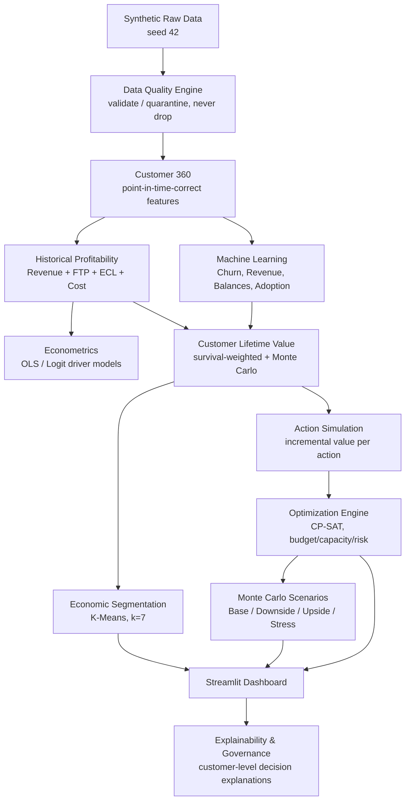
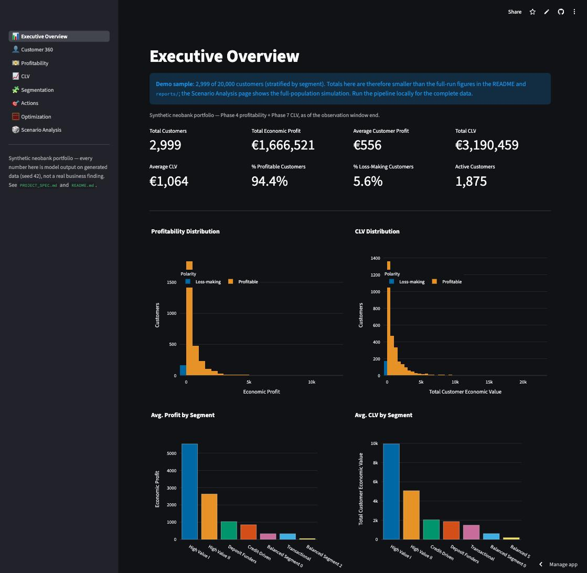
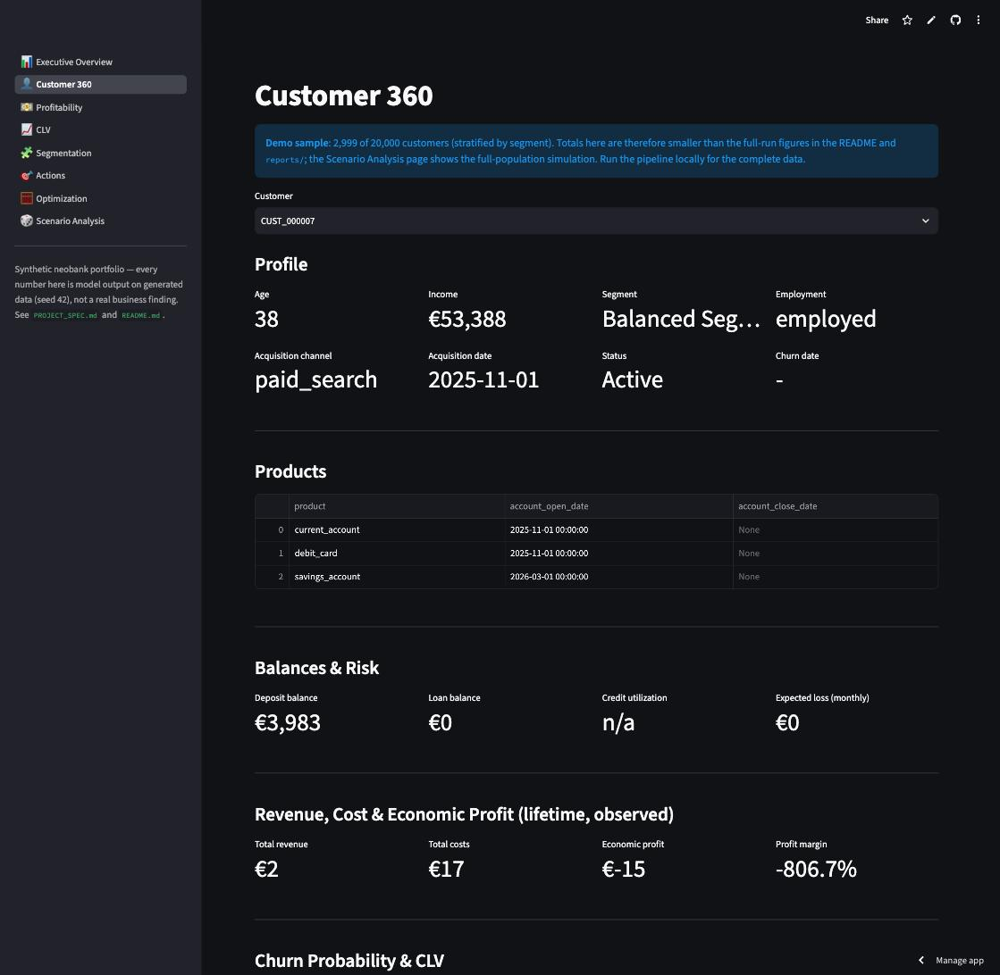
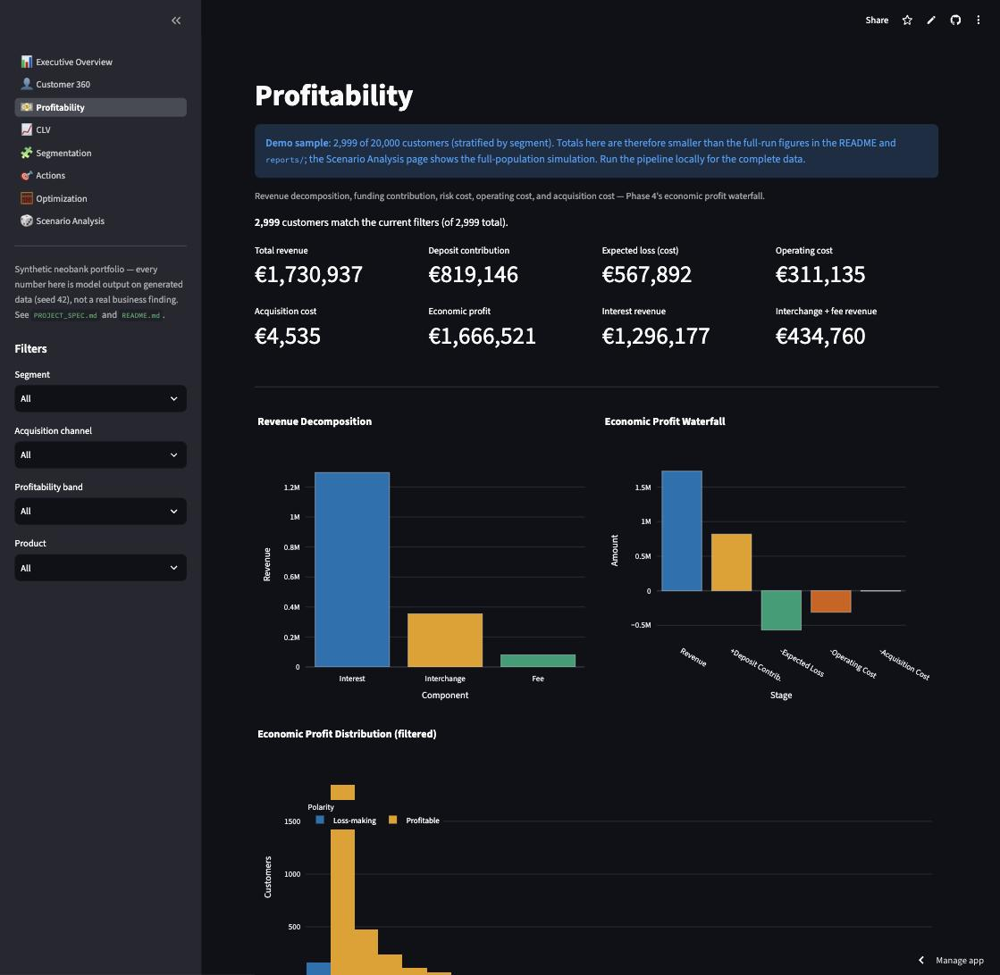
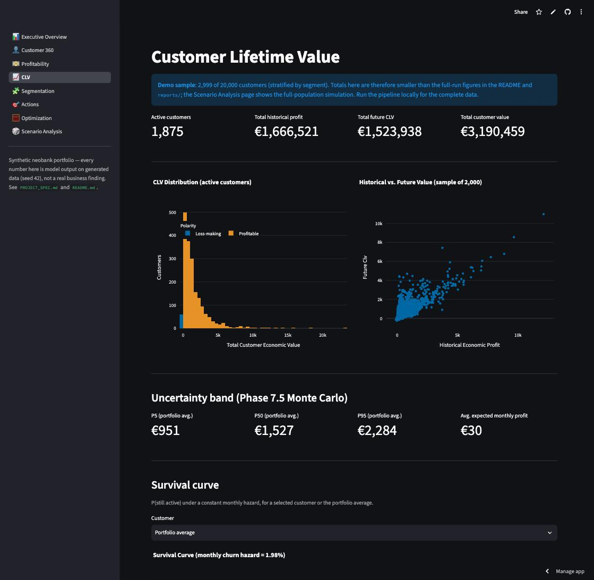
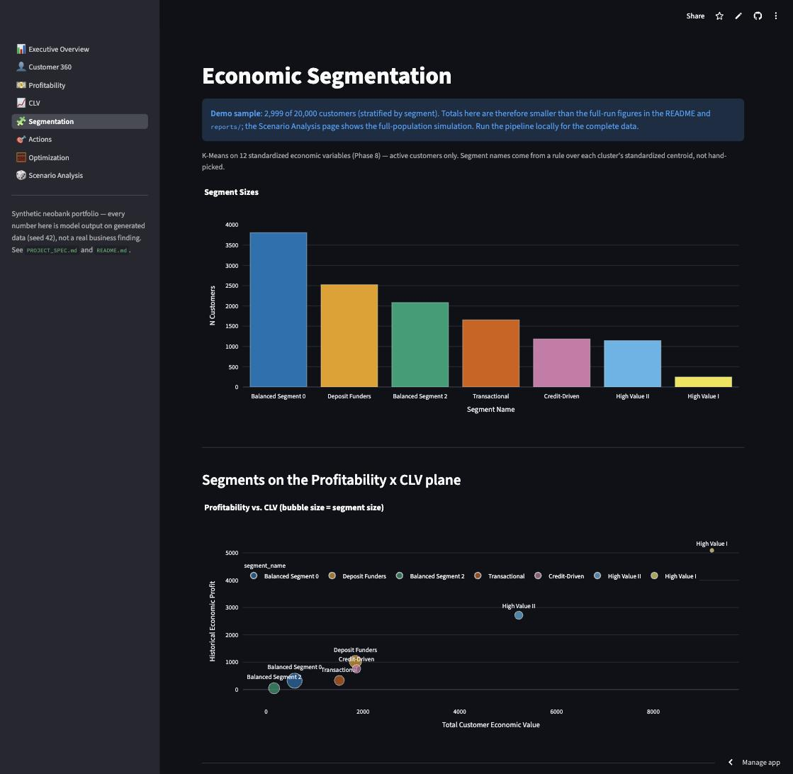
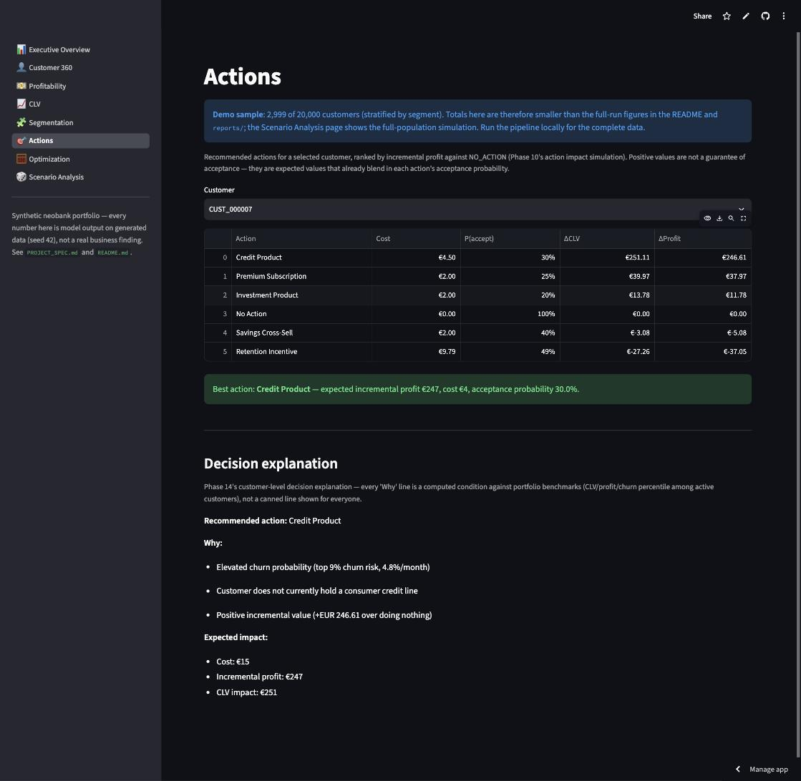
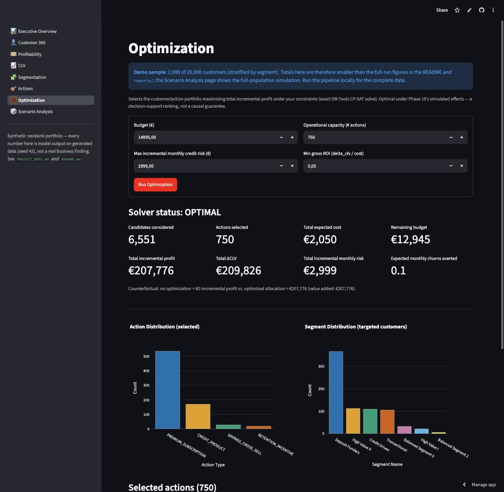
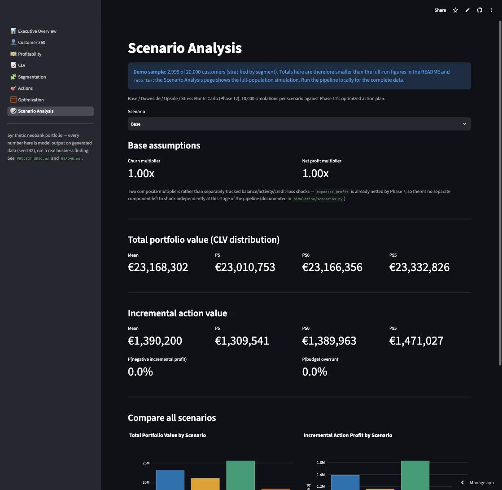

# Customer Profitability & Action Optimization Engine

[](https://github.com/AlvaroVerona/customer-profitability-engine/actions/workflows/ci.yml)


**[Live demo](https://customer-profitability-engine.streamlit.app/)** (runs on a 3,000-customer sample of the
20,000-customer dataset) · or locally:

```bash
git clone https://github.com/AlvaroVerona/customer-profitability-engine.git
cd customer-profitability-engine
pip install -e .
streamlit run app/app.py     # no pipeline run needed: uses demo_data/
```

**A customer-level economic decision engine for a synthetic neobank** that
combines profitability accounting, Funds Transfer Pricing, credit risk,
econometrics, machine learning, Customer Lifetime Value, simulation, and
mathematical optimization to determine where customer value comes from
and how a bank should allocate a limited budget to maximize incremental
economic profit.

The system does not only predict customer behavior — it translates those
predictions into economic value and then into constrained business
decisions.

All 18 phases of [`PROJECT_SPEC.md`](PROJECT_SPEC.md) are complete: data
generation, quality, profitability, econometrics, ML, CLV, segmentation,
action simulation, optimization, scenario analysis, a Streamlit
dashboard, explainability/governance, model validation, testing, and a
final report. See [`reports/final_report.md`](reports/final_report.md)
for the full narrative findings and [`docs/BUILD_LOG.md`](docs/BUILD_LOG.md)
for the detailed phase-by-phase engineering record (every real bug found
and fixed, every documented simplification).

**Every number in this README is real pipeline output** (seed 42, fully
reproducible — see [Reproducibility](#reproducibility)), not an
illustrative example. All data is synthetic; no real customer, account,
or transaction data is used anywhere in this project.

## Business Problem

A bank generally knows its *aggregate* revenue and cost, but not, at the
individual customer level: which customers are actually profitable once
funding cost and credit risk are properly charged; what each customer is
worth *going forward*, not just historically; which natural groups of
customers behave alike economically; and — critically — **given a
limited retention/growth budget, which specific customers should receive
which action** to maximize incremental profit without breaching
operational-capacity or credit-risk limits.

This project builds a synthetic but internally consistent 20,000-customer
neobank (36 months of history, seed-42 reproducible) and a full
analytical pipeline that answers exactly that question end to end.

## Solution

```text
Customer 360
  → Historical Profitability (Revenue, FTP, Expected Credit Loss, Operating Cost)
  → Risk Adjustment (Risk-Adjusted Contribution, Economic Profit)
  → Machine Learning (Churn, Revenue, Balances, Product Adoption — forecasts, not fabrication)
  → Customer Lifetime Value (survival-weighted, with Monte Carlo uncertainty)
  → Economic Segmentation (K-Means on economic behavior, never demographics)
  → Action Simulation (incremental value of 5 possible interventions per customer)
  → Optimization (exact CP-SAT allocation under budget/capacity/risk constraints)
  → Recommended Actions + Decision Explanations (Streamlit dashboard)
```

Every stage reads only the *already-validated* output of the stage
before it — nothing downstream ever reaches back into raw or quarantined
data, and every forecasting target uses a **time-based** train/validation/
test split (never a random one), since every target is a genuine
forward-in-time prediction.

## Key Technical Components

| Component | What it does | Headline result (current run) |
|---|---|---|
| **Customer Profitability** | Revenue, cost, and profit waterfall per customer-month | 94.3% of 20,000 customers individually profitable; EUR 11.3M total historical economic profit |
| **Funds Transfer Pricing** | Prices internal funding value of customer deposits | EUR 5.5M total deposit contribution |
| **Expected Credit Loss** | `PD x LGD x EAD` per loan per month | EUR 4.2M total expected loss — the single largest cost line, ahead of operating cost |
| **Econometrics** | Interpretable OLS/logit driver models with HC3 SEs, VIF, Breusch-Pagan | Churn model recovers every driver's true sign from the generating mechanism |
| **Machine Learning** | Churn, revenue, balance, and product-adoption forecasters, always benchmarked against a linear/logistic baseline | The baseline is itself the champion on 3 of 8 targets — a real, reported finding, not hidden |
| **Customer Lifetime Value** | Survival-weighted, discounted future profit, with Monte Carlo bands | EUR 21.8M total customer economic value across 12,651 active customers |
| **Economic Segmentation** | K-Means on 12 standardized economic variables (k=7) | From "Balanced Segment 2" (EUR 46 avg. profit) to "High Value I" (EUR 5,092 avg. profit) |
| **Action Simulation & Optimization** | Simulated incremental value per action, then an exact 0/1 integer program (OR-Tools CP-SAT) allocates under budget/capacity/risk | 5,000 of 44,406 candidates selected, EUR 1.38M incremental profit, risk constraint binds exactly at its EUR 20,000 cap |
| **Monte Carlo Scenario Analysis** | Base/Downside/Upside/Stress portfolio simulation | Incremental profit stays positive in every simulated draw, even under Stress |
| **Explainability & Governance** | Customer-level "why this action" explanations against portfolio benchmarks, not canned text | See [`reports/explainability_governance.md`](reports/explainability_governance.md) |

## Mathematical Formulation

**Economic profit waterfall** (`profitability/engine.py`):

```text
gross_contribution         = total_revenue + deposit_contribution - operating_cost
risk_adjusted_contribution = gross_contribution - expected_loss
economic_profit             = risk_adjusted_contribution - acquisition_cost
```

**Funds Transfer Pricing** (`profitability/ftp.py`):

```text
deposit_contribution = avg_deposit_balance * (ftp_rate - customer_deposit_rate) / 12
```

**Expected Credit Loss** (`profitability/risk_cost.py`):

```text
expected_loss = PD * LGD * EAD          (summed over every loan a customer holds each month)
```

**Customer Lifetime Value** (`clv/calculator.py`, survival-weighted annuity):

```text
CLV_i = HistoricalEconomicProfit_i + sum_t [ P(Survival_t) * ExpectedProfit_t ] / (1 + r)^t
```

**Optimization** (`optimization/model.py`, exact CP-SAT integer program):

```text
max   sum_i sum_a  x_{i,a} * IncrementalProfit_{i,a}
s.t.  sum_a  x_{i,a}                          <= 1        (one action per customer)
      sum_{i,a}  x_{i,a} * ExpectedCost_{i,a}  <= Budget
      sum_{i,a}  x_{i,a}                       <= Capacity
      sum_{i,a}  x_{i,a} * ExpectedRisk_{i,a}   <= MaxRisk
      x_{i,a} in {0, 1}
```

## Architecture



## Dashboard

An 8-page Streamlit decision-support dashboard (`app/`, `make app`). A hosted demo runs on a stratified 3,000-customer sample
(`demo_data/`, rebuilt with `make demo-data`) because the full pipeline output is ~300 MB;
the dashboard shows a banner when it is on the sample and scales the optimization
constraints to match:
Executive Overview, Customer 360, Profitability, CLV, Segmentation,
Actions, Optimization (re-solves the real CP-SAT model live against your
own budget/capacity/risk inputs), and Scenario Analysis.

<p align="center">
  
  
  
  
  
  
  
  
</p>

Executive Overview · Customer 360 · Profitability · CLV · Segmentation · Actions ·
Optimization (a live re-solve of the same CP-SAT model used in the pipeline) ·
Scenario Analysis. Try them in the [live demo](https://customer-profitability-engine.streamlit.app/).
Screenshots show the 3,000-customer demo sample, hence the banner.

## Reproducibility

Everything is seeded (`seed: 42` in `config/settings.yaml`); rerunning
`make generate-data` reproduces byte-identical raw data, and every
downstream stage is deterministic given that data.

```bash
make install           # uv sync
make generate-data     # regenerate data/raw/*.parquet (seed 42)
make quality           # data quality engine -> data/processed/, reports/
make features          # Customer 360 -> data/features/customer_360.parquet
make profitability     # profitability engine -> data/processed/profitability_*.parquet
make econometrics      # revenue/churn driver models -> reports/econometrics_report.{md,json}
make models            # fit all Phase 6 models, persist champions -> reports/ml_report.{md,json}
make validation        # baseline-vs-champion + split summary -> reports/model_validation_report.md
make clv                # CLV (needs make models) -> data/processed/clv.parquet
make segmentation       # cluster customers (needs make clv) -> reports/segmentation_report.{md,json}
make actions            # action catalog + eligibility -> reports/actions_report.{md,json}
make action-simulation  # incremental value per action -> reports/action_simulation_report.{md,json}
make optimize           # solve the allocation -> reports/optimization_report.{md,json}
make montecarlo         # scenario simulation (needs make optimize) -> reports/monte_carlo_report.{md,json}
make governance         # explainability/governance write-up -> reports/explainability_governance.md
make final-report       # 8-section final report -> reports/final_report.md
make demo-data          # rebuild the 3,000-customer sample the hosted demo runs on (demo_data/)
make all                # every stage above, in order, then the tests
make app                # launch the Streamlit dashboard
make test               # run the test suite
make lint               # ruff check src tests app
```

## Repository Structure

```text
config/                          settings.yaml (all parameters, seed 42)
demo_data/                       3,000-customer sample the hosted dashboard runs on
data/{raw,processed,features}/   generated data at every pipeline stage
reports/                         every phase's markdown/JSON report + figures + final_report.md
src/customer_profitability/
  data/            generator, schemas, quality engine
  features/        Customer 360 feature pipeline
  profitability/   revenue, FTP, risk cost, operating cost, waterfall engine
  econometrics/     OLS/logit driver models, diagnostics
  models/            ML forecasters (churn, revenue, balances, adoption) + validation
  clv/                Customer Lifetime Value + discounting + Monte Carlo
  segmentation/        K-Means economic segmentation
  actions/              action definitions, simulation, incremental value, explanations
  optimization/          CP-SAT model, constraints, solver, selection explanations
  simulation/              portfolio Monte Carlo scenarios
  governance/               explainability/governance report
  reporting/                 final report
  utils/                     config, logging, metrics
app/                              Streamlit dashboard (8 pages)
tests/                            159 tests, hand-calculated / hand-built-fixture where it matters
docs/BUILD_LOG.md                 detailed phase-by-phase engineering record
```

## Tech Stack

Python, pandas, NumPy, DuckDB, PyArrow, statsmodels, SciPy, scikit-learn,
XGBoost, SHAP, OR-Tools, Plotly, Matplotlib, Streamlit, pytest, uv.

## Further Reading

- [`reports/final_report.md`](reports/final_report.md) — the full 8-section findings narrative
- [`reports/explainability_governance.md`](reports/explainability_governance.md) — methodology + worked customer examples
- [`reports/model_validation_report.md`](reports/model_validation_report.md) — baseline-vs-champion, per target
- [`data/README.md`](data/README.md) — synthetic data generation & churn mechanism
- [`docs/BUILD_LOG.md`](docs/BUILD_LOG.md) — phase-by-phase engineering diary, every bug found and fixed
- [`PROJECT_SPEC.md`](PROJECT_SPEC.md) — the full 18-phase specification this project implements

## Limitations

This project uses **entirely synthetic data** for a fictional neobank; no
real institution's data is used anywhere. Profitability, CLV, and action
values are model-based, not verified real-world outcomes; ML predictions
carry quantified uncertainty (calibration, Monte Carlo bands); action
incremental value is a *simulated* treatment effect, not a causally
identified one from a real experiment; FTP and customer-behavior
mechanisms are documented simplifications. See
[`reports/final_report.md`](reports/final_report.md) section 8 for the
full discussion, and
[`reports/explainability_governance.md`](reports/explainability_governance.md)
for the Responsible Decision-Making documentation
(`PROJECT_SPEC.md` section 26).
